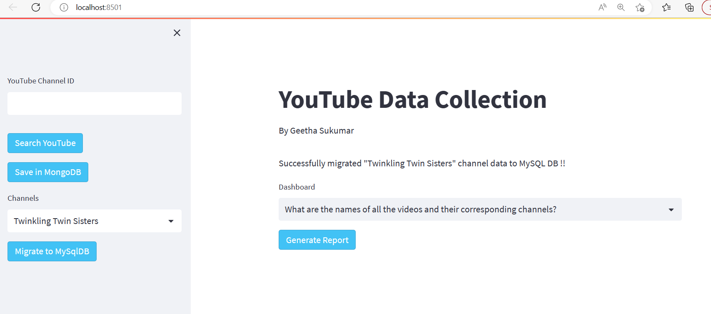
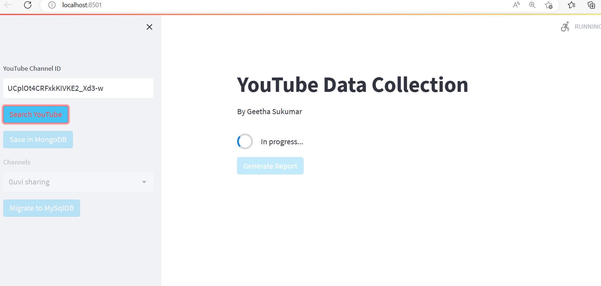
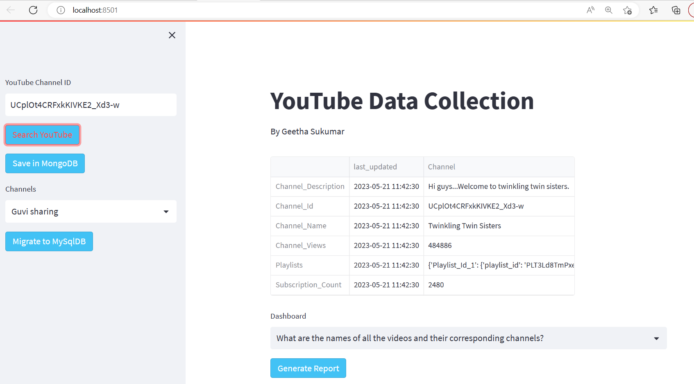
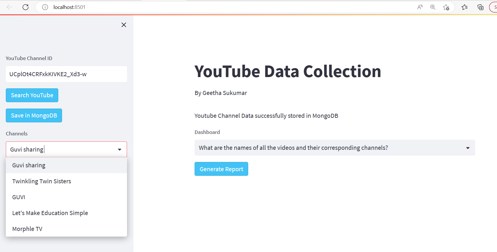
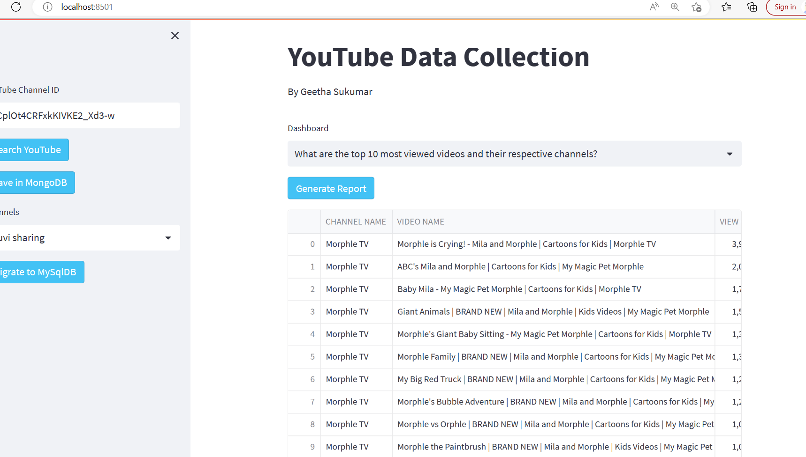

# YouTube Data Collection
YouTube Channel Data Collection using StreamLit and Google Api

## Objective
YouTube Data Harvesting and Warehousing using SQL, MongoDB and Streamlit.
This project aims to develop a user-friendly Streamlit application that utilizes the Google API to extract information on a YouTube channel, stores it in a MongoDB database, migrates it to a SQL data warehouse, and enables users to search for channel details and join tables to view data in the Streamlit app.

## Prerequisties
1. Youtube API key generation for your username
2. Install the below python packages
  googleapiclient.discovery
  pymongo
  mysql.connector
  streamlit
  
## Setup
1. Pull the main python script YouTube_Data_Collection. py
2. Pull the configuation file YTD_configs.py. This file stores the configuration details for the Youtube API key, mongoDB
3. Change the configuration settings accodringly for MongoDB, Google API key
4. The Reports generated from the Channel data stored in MySQL is based on the different questions. These questions are configurable and the queries for the report is also configured in the YTD_config.py file.

## Run the Application
1. Go to Command Prompt
2. Change the working directory to the Directory where the code is pulled to 
3. Run the below code to run the Application in the browser
    streamlit run youtube_Data_collection.py

## Results

## Contact
Geetha Sukumar
geethsruthi@gmail.com
